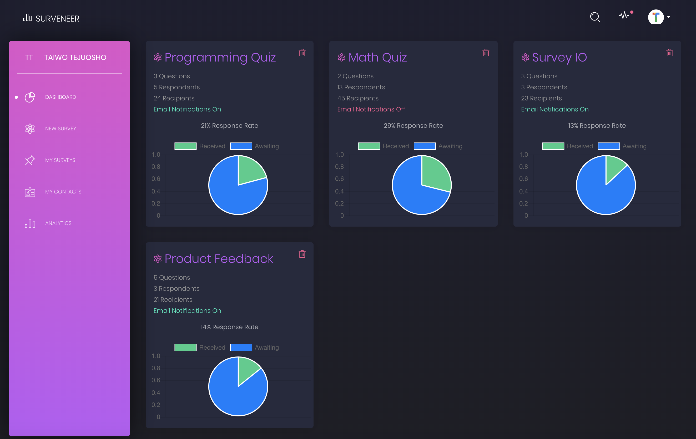
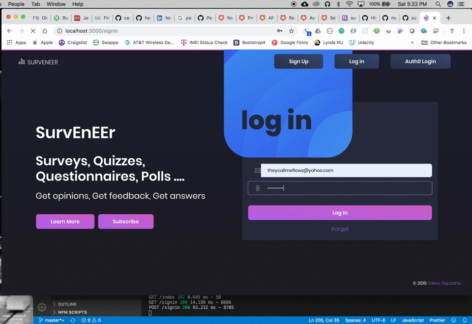

# SurvEnEEr
Create Surveys and Analyze data from the Surveys

## Built With

* Express
* Node.js
* Passport
* MySQL
* Handlebars
* Sequelize
* (a full list of dependencies can be found in `package.json`)
* Deployed to Heroku

## Getting Started

These instructions will get you a copy of the project up and running on your local machine for development and testing purposes. See deployment for notes on how to deploy the project on a live system.

### Prerequisites

Before you get started, make sure you have the following software installed on your computer:

- [Node.js](https://nodejs.org/en/)
- [MySQL](https://www.mysql.com/)
- [Nodemon](https://nodemon.io/)

### Installing

## Completed Features

### Dashboard

### Sign Up

### Create A Survey

### Real time updates

### Password Reset

### Next Steps

Additional features to be implemented in the future:

- [ ] Email Templates
- [ ] Survey Types/Templates
- [ ] Real time update for response rate charts
- [ ] Response Views
- [ ] Survey Sharing

## Deployment

Add additional notes about how to deploy this on a live system

## Author

* Taiwo Tejuosho

## License
[MIT](https://choosealicense.com/licenses/mit/)
